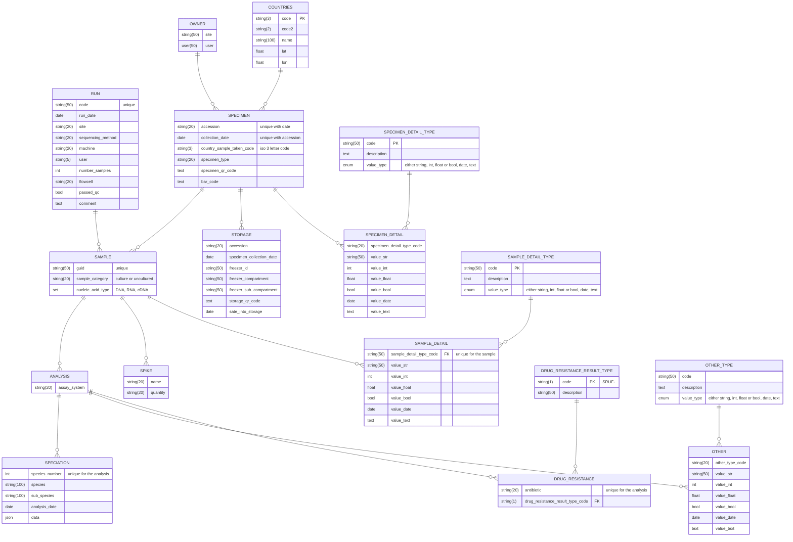

# Database layout

The following diagram does not include the index fields for most of the tables,
this is to simplify the display.

```mermaid
erDiagram
    OWNER {
        string(50) site
        user(50) user
    }

    RUN {
        string(50) code "unique"
        date run_date
        string(20) site
        string(20) sequencing_method
        string(20) machine
        string(5) user
        int number_samples
        string(20) flowcell
        bool passed_qc
        text comment
    }

    SPECIMEN {
        string(20) accession "unique with date"
        date collection_date "unique with accession"
        string(3) country_sample_taken_code "iso 3 letter code"
        string(20) specimen_type
        text specimen_qr_code
        text bar_code
    }

    SPECIMEN_DETAIL {
        string(20) specimen_detail_type_code
        string(50) value_str
        int value_int
        float value_float
        bool value_bool
        date value_date
        text value_text
    }

    SPECIMEN_DETAIL_TYPE {
        string(50) code PK
        text description
        enum value_type "either string, int, float or bool, date, text"
    }

    COUNTRIES {
        string(3) code PK
        string(2) code2
        string(100) name
        float lat
        float lon
    }

    SAMPLE {
        string(50) guid "unique"
        string(20) sample_category "culture or uncultured"
        set nucleic_acid_type "DNA, RNA, cDNA"
    }

    STORAGE {
        string(20) accession
        date specimen_collection_date
        string(50) freezer_id
        string(50) freezer_compartment
        string(50) freezer_sub_compartment
        text storage_qr_code
        date sate_into_storage
    }

    SPIKE {
        string(20) name
        string(20) quantity
    }

    SAMPLE_DETAIL {
        string(50) sample_detail_type_code FK "unique for the sample"
        string(50) value_str
        int value_int
        float value_float
        bool value_bool
        date value_date
        text value_text
    }

    SAMPLE_DETAIL_TYPE {
        string(50) code PK
        text description
        enum value_type "either string, int, float or bool, date, text"
    }

    ANALYSIS {
        string(20) assay_system
    }

    SPECIATION {
        int species_number "unique for the analysis"
        string(100) species
        string(100) sub_species
        date analysis_date
        json data
    }

    DRUG_RESISTANCE {
        string(20) antibiotic "unique for the analysis"
        string(1) drug_resistance_result_type_code FK
    }

    DRUG_RESISTANCE_RESULT_TYPE {
        string(1) code PK "SRUF-"
        string(50) description
    }

    OTHER {
        string(20) other_type_code
        string(50) value_str
        int value_int
        float value_float
        bool value_bool
        date value_date
        text value_text
    }

    OTHER_TYPE {
        string(50) code
        text description
        enum value_type "either string, int, float or bool, date, text"
    }

    RUN ||--o{ SAMPLE : ""
    OWNER ||--o{ SPECIMEN : ""
    COUNTRIES ||--o{ SPECIMEN : ""
    SPECIMEN ||--o{ SAMPLE : ""
    SPECIMEN ||--o{ STORAGE : ""
    SPECIMEN ||--o{ SPECIMEN_DETAIL : ""
    SPECIMEN_DETAIL_TYPE ||--o{ SPECIMEN_DETAIL : ""
    SAMPLE ||--o{ ANALYSIS : ""
    SAMPLE ||--o{ SPIKE : ""
    ANALYSIS ||--o{ SPECIATION : ""
    ANALYSIS ||--o{ OTHER : ""
    OTHER_TYPE ||--o{ OTHER : ""
    ANALYSIS ||--o{ DRUG_RESISTANCE : ""
    DRUG_RESISTANCE_RESULT_TYPE ||--o{ DRUG_RESISTANCE : ""
    SAMPLE ||--o{ SAMPLE_DETAIL: ""
    SAMPLE_DETAIL_TYPE ||--o{ SAMPLE_DETAIL: ""
```
