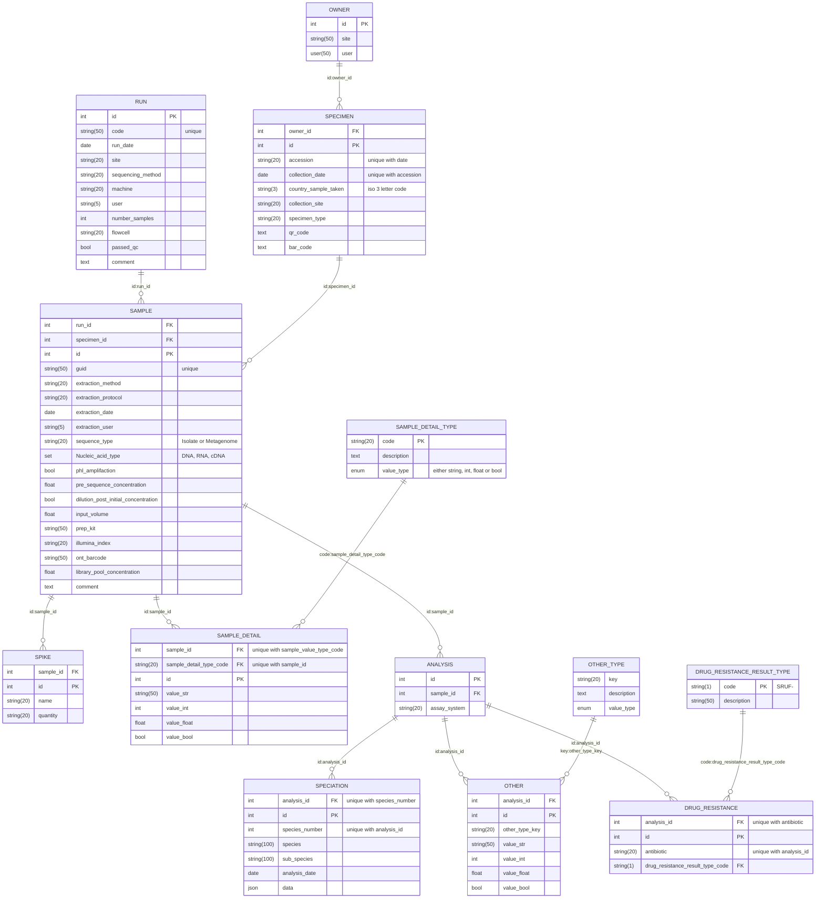

# Database layout

```mermaid
erDiagram
    OWNER {
        int id PK
        string(50) site
        user(50) user
    }

    RUN {
        int id PK
        string(50) code "unique"
        date run_date
        string(20) site
        string(20) sequencing_method
        string(20) machine
        string(5) user
        int number_samples
        string(20) flowcell
        bool passed_qc
        text comment
    }

    SPECIMEN {
        int owner_id FK
        int id PK
        string(20) accession "unique with date"
        date collection_date "unique with accession"
        string(3) country_sample_taken "iso 3 letter code"
        string(20) collection_site
        string(20) specimen_type
        text qr_code
        text bar_code
    }

    SAMPLE {
        int run_id FK
        int specimen_id FK
        int id PK
        string(50) guid "unique"
        string(20) extraction_method
        string(20) extraction_protocol
        date extraction_date
        string(5) extraction_user
        string(20) sequence_type "Isolate or Metagenome"
        set Nucleic_acid_type "DNA, RNA, cDNA"
        bool phl_amplifaction
        float pre_sequence_concentration
        bool dilution_post_initial_concentration
        float input_volume
        string(50) prep_kit
        string(20) illumina_index
        string(50) ont_barcode
        float library_pool_concentration
        text comment
    }

    SPIKE {
        int sample_id FK
        int id PK
        string(20) name
        string(20) quantity
    }

    SAMPLE_DETAIL {
        int sample_id FK "unique with sample_value_type_code"
        string(20) sample_detail_type_code FK "unique with sample_id"
        int id PK
        string(50) value_str
        int value_int
        float value_float
        bool value_bool
    }

    SAMPLE_DETAIL_TYPE {
        string(20) code PK
        text description
        enum value_type "either string, int, float or bool"
    }

    ANALYSIS {
        int id PK
        int sample_id FK
        string(20) assay_system
    }

    SPECIATION {
        int analysis_id FK "unique with species_number"
        int id PK
        int species_number "unique with analysis_id"
        string(100) species
        string(100) sub_species
        date analysis_date
        json data
    }

    DRUG_RESISTANCE {
        int analysis_id FK "unique with antibiotic"
        int id PK
        string(20) antibiotic "unique with analysis_id"
        string(1) drug_resistance_result_type_code FK
    }

    DRUG_RESISTANCE_RESULT_TYPE {
        string(1) code PK "SRUF-"
        string(50) description
    }

    OTHER {
        int analysis_id FK
        int id PK
        string(20) other_type_key
        string(50) value_str
        int value_int
        float value_float
        bool value_bool
    }

    OTHER_TYPE {
        string(20) key
        text description
        enum value_type
    }

    RUN ||--o{ SAMPLE : "id:run_id"
    OWNER ||--o{ SPECIMEN : "id:owner_id"
    SPECIMEN ||--o{ SAMPLE : "id:specimen_id"
    SAMPLE ||--o{ ANALYSIS : "id:sample_id"
    SAMPLE ||--o{ SPIKE : "id:sample_id"
    ANALYSIS ||--o{ SPECIATION : "id:analysis_id"
    ANALYSIS ||--o{ OTHER : "id:analysis_id"
    OTHER_TYPE ||--o{ OTHER : "key:other_type_key"
    ANALYSIS ||--o{ DRUG_RESISTANCE : "id:analysis_id"
    DRUG_RESISTANCE_RESULT_TYPE ||--o{ DRUG_RESISTANCE : "code:drug_resistance_result_type_code"
    SAMPLE ||--o{ SAMPLE_DETAIL: "id:sample_id"
    SAMPLE_DETAIL_TYPE ||--o{ SAMPLE_DETAIL: "code:sample_detail_type_code"
```
