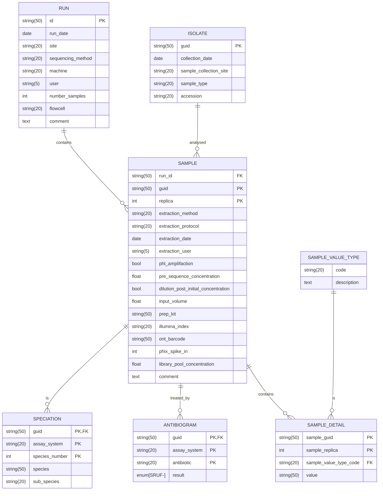

# Database layout

```mermaid
erDiagram
    RUN {
        string(50) id PK
        date run_date
        string(20) site
        string(20) sequencing_method
        string(20) machine
        string(5) user
        int number_samples
        string(20) flowcell
        text comment
    }

    ISOLATE {
        string(50) guid PK
        date collection_date
        string(20) sample_collection_site
        string(20) sample_type
        string(20) accession
    }

    SAMPLE {
        string(50) run_id FK
        string(50) guid PK
        int replica PK
        string(20) extraction_method
        string(20) extraction_protocol
        date extraction_date
        string(5) extraction_user
        bool phl_amplifaction
        float pre_sequence_concentration
        bool dilution_post_initial_concentration
        float input_volume
        string(50) prep_kit
        string(20) illumina_index
        string(50) ont_barcode
        int phix_spike_in
        float library_pool_concentration
        text comment
    }

    SAMPLE_DETAIL {
        string(50) sample_guid PK
        int sample_replica PK
        string(20) sample_value_type_code FK
        string(50) value
    }

    SAMPLE_VALUE_TYPE {
        string(20) code
        text description
    }

    SPECIATION {
        string(50) guid PK, FK
        string(20) assay_system PK
        int species_number PK
        string(50) species
        string(20) sub_species
    }

    ANTIBIOGRAM {
        string(50) guid PK, FK
        string(20) assay_system PK
        string(20) antibiotic PK
        enum[SRUF-] result
    }

    RUN ||--o{ SAMPLE : contains
    ISOLATE ||--o{ SAMPLE : analysed
    SAMPLE ||--o{ SPECIATION : is
    SAMPLE ||--o{ ANTIBIOGRAM : treated_by
    SAMPLE ||--o{ SAMPLE_DETAIL: contains
    SAMPLE_VALUE_TYPE ||--o{ SAMPLE_DETAIL: is
```
