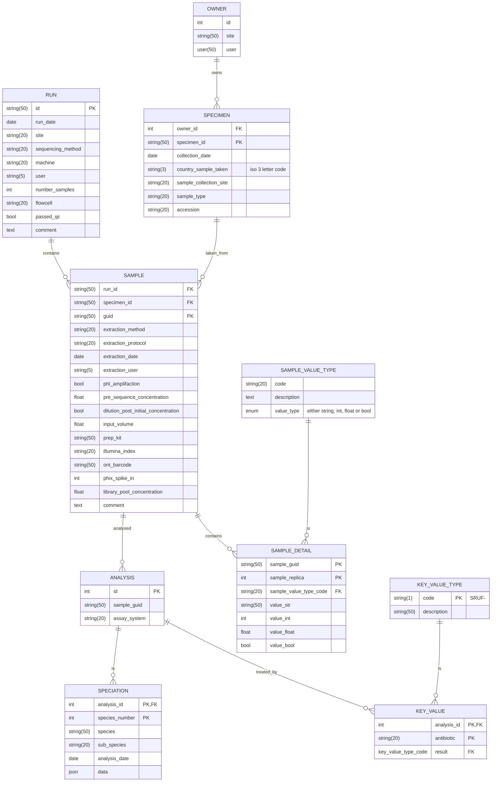

# Database layout

```mermaid
erDiagram
    OWNER {
        int id
        string(50) site
        user(50) user
    }

    RUN {
        string(50) id PK
        date run_date
        string(20) site
        string(20) sequencing_method
        string(20) machine
        string(5) user
        int number_samples
        string(20) flowcell
        bool passed_qc
        text comment
    }

    SPECIMEN {
        int owner_id FK
        string(50) specimen_id PK
        date collection_date
        string(3) country_sample_taken "iso 3 letter code"
        string(20) sample_collection_site
        string(20) sample_type
        string(20) accession
    }

    SAMPLE {
        string(50) run_id FK
        string(50) specimen_id FK
        string(50) guid PK
        string(20) extraction_method
        string(20) extraction_protocol
        date extraction_date
        string(5) extraction_user
        bool phl_amplifaction
        float pre_sequence_concentration
        bool dilution_post_initial_concentration
        float input_volume
        string(50) prep_kit
        string(20) illumina_index
        string(50) ont_barcode
        int phix_spike_in
        float library_pool_concentration
        text comment
    }

    SAMPLE_DETAIL {
        string(50) sample_guid PK
        int sample_replica PK
        string(20) sample_value_type_code FK
        string(50) value_str
        int value_int
        float value_float
        bool value_bool
    }

    SAMPLE_VALUE_TYPE {
        string(20) code
        text description
        enum value_type "either string, int, float or bool"
    }

    ANALYSIS {
        int id PK
        string(50) sample_guid
        string(20) assay_system
    }

    SPECIATION {
        int analysis_id PK, FK
        int species_number PK
        string(50) species
        string(20) sub_species
        date analysis_date
        json data
    }

    KEY_VALUE {
        int analysis_id PK, FK
        string(20) antibiotic PK
        key_value_type_code result FK
    }

    KEY_VALUE_TYPE {
        string(1) code PK "SRUF-"
        string(50) description
    }

    RUN ||--o{ SAMPLE : contains
    OWNER ||--o{ SPECIMEN : owns
    SPECIMEN ||--o{ SAMPLE : taken_from
    SAMPLE ||--o{ ANALYSIS : analysed
    ANALYSIS ||--o{ SPECIATION : is
    ANALYSIS ||--o{ KEY_VALUE : treated_by
    KEY_VALUE_TYPE ||--o{ KEY_VALUE : is
    SAMPLE ||--o{ SAMPLE_DETAIL: contains
    SAMPLE_VALUE_TYPE ||--o{ SAMPLE_DETAIL: is
```
