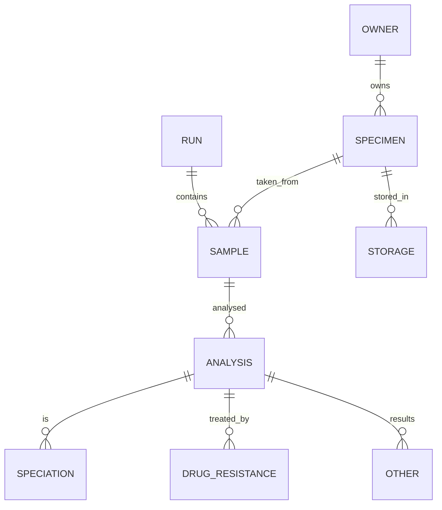

# Entity Relationship Diagram

```mermaid
erDiagram
    OWNER
    RUN
    SPECIMEN
    STORAGE
    SAMPLE
    ANALYSIS
    SPECIATION
    DRUG_RESISTANCE
    OTHER

    RUN ||--o{ SAMPLE : contains
    OWNER ||--o{ SPECIMEN : owns
    SPECIMEN ||--o{ SAMPLE : taken_from
    SPECIMEN ||--o{ STORAGE : stored_in
    SAMPLE ||--o{ ANALYSIS : analysed
    ANALYSIS ||--o{ SPECIATION : is
    ANALYSIS ||--o{ DRUG_RESISTANCE : treated_by
    ANALYSIS ||--o{ OTHER : results
```
